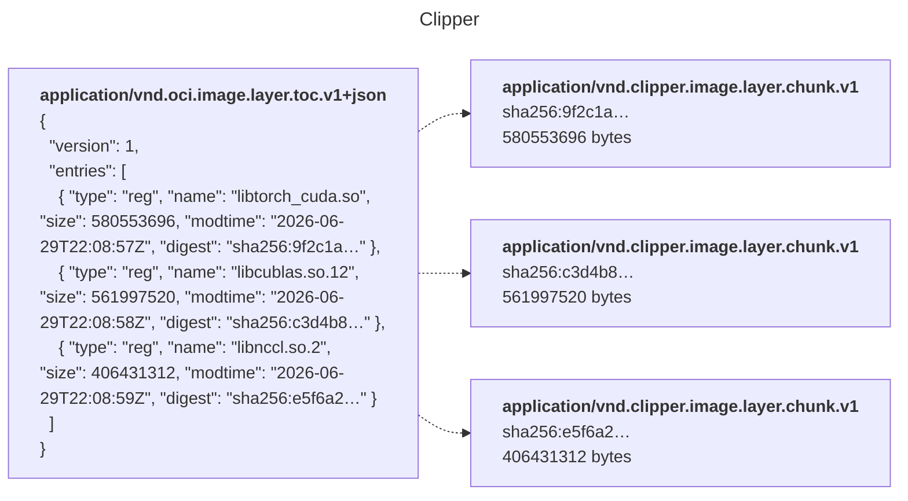

# clipper cache

An action to cache directories with [Clipper](https://clipper.dev). Directories are FUSE mounted, large files are only fetched when opened.

## Usage

> [!NOTE]
> Linux runners only for now; macOS and Windows support coming soon.

A Clipper account is required to use this action.

1. Create an account at https://clipper.dev/login
2. Go to https://clipper.dev/repositories/tokens to generate a token with push, pull, and create scopes.
3. Add the token to your repo or org
4. Add the action to your workflow, like so:

```yaml
- uses: clipper-registry/cache@main
  env:
    CLIPPER_CREDENTIALS: ${{ secrets.CLIPPER_CI_CREDENTIALS }}
  with:
    path: build/
    repo: clipper.dev/myorg/mycache
    key: linux-x86_64
```

- **Mount**: the branch is appended to `key` automatically, so `<key>-<branch>` is tried first, then `<key>-<base>` (the PR's base branch, or the repository default branch). If nothing resolves, the job runs cold on a plain directory.
- **Push**: on job success, changes are pushed to `<key>-<branch>`. To also push when the job fails, set `CLIPPER_CACHE_ON_FAILURE: "true"` in the job env.

### Inputs

| input | default | description |
|---|---|---|
| `path` | — | directory to cache |
| `repo` | — | registry repository for the cache tags |
| `key` | — | cache key prefix; the branch is appended automatically |
| `base-branch` | derived | fallback lineage branch (defaults to the PR base branch, else the repository default branch) |
| `split-glob` | `""` | Glob paths to split small file packs on. |
| `cdc` | `true` | content-defined chunking on push |
| `jobs` | `16` | parallel transfer jobs |
| `version` | `latest` | clipper CLI version |

Outputs: `cache-hit`, `push-tag`.

## Language specific implementations

### Rust Incremental Cache

See [`rust/`](rust/)

### ccache

Coming soon!

## Clipper FAQ

### What is Clipper?

Clipper is a container registry with up to 10x faster pulls and 7x faster builds over regular Docker.

As a side effect of implementing faster BuildKit builds, I ended up with a mountable filesystem backed by a remote content defined store.

### Why cache with Clipper?

Tarballing large directories to be stored in the GitHub Actions cache is slow. It's quite easy to go over your workspace limits, and it doesn't scale well with the size of the workspace. There's a tradeoff here: in general caches should be as big as reasonably possible, but it's inefficient to fetch cache that your build isn't using. 

### How does Clipper work?

Rather than using tarballs (such as traditional Docker layers and GitHub actions caches do), Clipper indexes filesystems. When a filesystem is pushed to the registry, only files that the registry has never seen before are pushed. (Additionally, this allows for sharing content between different caches!)


